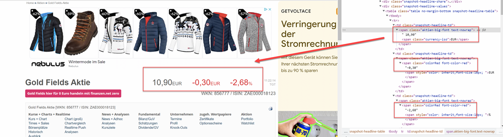
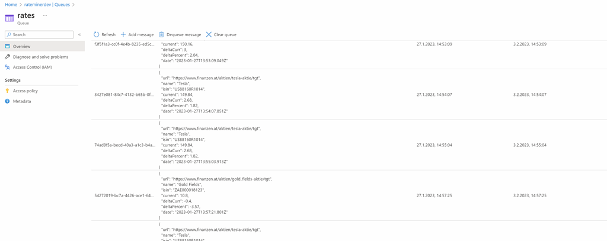

# Stock Planner App

App can be created by executing `deploy/create-app.azcli`

## Rate Miner

Gets rates from a website based on a timer triggered function app and writes them to a queue. Azure Storage Queue because it's cheap and easy to use.

## Rate Processor

Reads rates from a queue and writes them to a sql sever database. Design decision was to use a queue to decouple the miner from the processor. SQL Server because it is there and cheap.
 

## Stock App UI

Angular App that consumens the data and visualizes it. It will use Client Side State (NgRx) and Real Time integration. So far it's just a mockup.