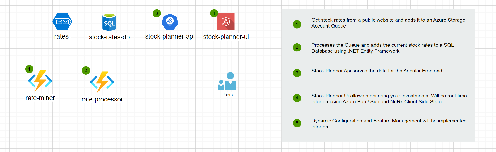

# Stock Planner

Small cloud native stock planning app that just came to my mind. It's a small project but it allows get into the mindset to move from a monolithic app to a cloud native, microservice based architecture.

I also need to mention that I needed it anyway :-) - Feel free to use it for your own needs, or join.

Current steps are to implement the base apps. Propper Idenitity Integration & DevOps will follow when the project is more stable.

## Architecture

Again, just a first draft. I'm sure it will change over time. But it's a good start.

